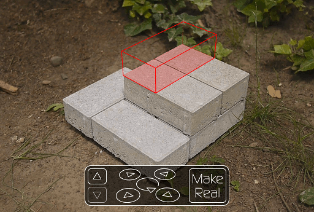
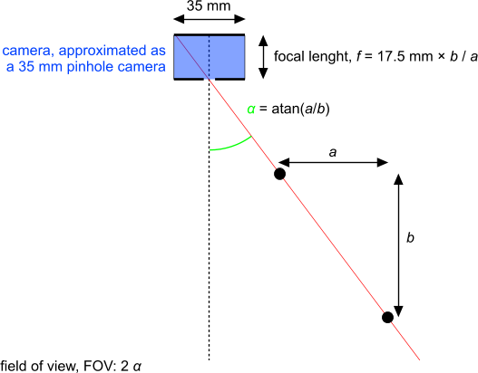
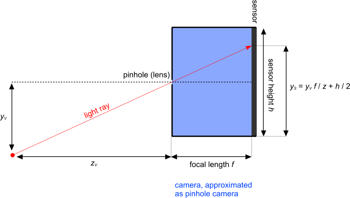

Introduction
============

The Reality Builder allows anyone on the web to direct the construction of a
physical structure. It is a web application that shows a webcam image of a
construction. Overlaid on that image is a virtual building block that the user
may position: augmented reality. The construction team works with the
application via a web-based administration interface.

Demo
====

Visit: [demo/index.html][1]

Sample Application
==================

Hosted on: [www.realitybuilder.com][2] ([source][3])

A video of a previous version is [available on YouTube][4].

About documentation
===================

See also sub directory: [documentation][5]

Hosting the Reality Builder
===========================

Host it using [Node.js][6], and - in production - don't forget to set the
environment variable:

    NODE_ENV=production

Embedding the Reality Builder in a web page
===========================================

Example where the Reality Builder is hosted on *example.com*:

 1. Embed Socket.IO into you page. You may use the distribution which comes
   with the Reality Builder. Example:
   
       

 2. Embed the Reality Builder:

      * Either as a standard JavaScript file:

            
            

            

            

      * Or as an AMD module (no global variable is exposed):

            require(
                ['http://example.com/reality_builder.js'],
                function (realityBuilder) {
                    realityBuilder.init(/* see above */);
                }
            );

See the [demo][1] for more information. The demo uses AMD with RequireJS to
load either the production or the development version of the Reality Builder.

Setup
=====

Blocks
------

Blocks must have the following shape: *Right prism with a convex outline.*

Blocks are solid, i.e. they never overlap.

Camera
------

The camera x-y position must be outside of the x-y area where blocks are to be
built, and it must look down onto the blocks. All blocks, thus, are in front to
the sensor.

This limitation on camera placement allows for simpler and speedier code.

Development
===========

Unit tests
----------

Run unit tests from the shell with [Nodeunit][7]:

    nodeunit tests

Creating a new build
--------------------

To create a new build, i.e. to compile all JavaScript files into
`reality_builder.js`, run from the shell:

    node node_modules/requirejs/bin/r.js -o client.build.js

Camera data
-----------

Perspective projection
----------------------

Terminology
-----------

  * Types of blocks:

      + New block: The block that may be positioned by the user.

      + Construction block: A block permanently in the construction.

        Types of construction blocks:

          - Real block: Block that is actually built.

          - Deleted block: Block that was deleted.

          - Pending block: Block that is not yet made real.

        The new, user positionable block is not part of the construction.

      + Shadow obscuring block: Block that is used for graphically removing
        parts of the new block's shadow that are not actually visible.

  * Specifiers for coordinates (see also "perspective.xar"):

      + The coordinate specifiers ending in "B", e.g. "xB", denote positions in
        the grid where blocks may be placed. The space comprised by those
        coordinates is called "block position space", or short: "block space"

        Units: none (multiples of distances between positions)

        Value: integer

      + The coordinate specifiers ending in "BXY", denote block positions in
        the block space x-y plane.

      + The coordinate specifiers ending in "V" denote coordinates in "view
        space", i.e. the space relative to the lens, approximated as a pinhole,
        of the camera:

            +---x
            |\
            | \
            |  z
            y

        Units: mm

        The origin of the view space is in the pinhole.

      + The coordinate specifiers ending in "VXZ" denote coordinates in the
        view space x-z-plane. Points in this plane get mapped onto the
        horizontal line in the middle of the sensor: y = 0 Points are describe
        using x, z coordinate tuples.

        Units: mm

      + The coordinate specifiers ending in "S" denote coordinates in "sensor
        space", i.e. coordinates of projected points. The origin of the sensor
        is in one of its corners.

        Units: px

      + The coordinate specifiers ending in "VXZS" denote coordinates in the
        horizontal line in sensor space that the view space x-z-plane is mapped
        to.

        Units: px

      + All other coordinates are in world space.

        Units: mm

        To get from block space to world space, multiply block space
        coordinates by factors in mm. The multiplication factors for "xB" and
        "yB" are identical. Otherwise a block that is rotated in a plane would
        deform. The multiplication factor for "zB", however, is independent.
        Example:

          - Multiplication factor x, y: 5mm

          - Multiplication factor z: 3mm

  * Point: Is specified as an array with two or three numbers: the coordinates.
    It is regarded as a vector, with its origin in the origin of the coordinate
    system.

  * Edge: Connects two vertices. Is specified as an array with two indices to a
    vertex array, and a third index whose value is the original index/name of
    the edge. The third value is important to identify edges in case they are
    reordered.

  * Line: straight line with infinite extends. Is specified as an array with
    two points that lie on it. If the points coincide, then the result of any
    function making use of the line is undefined.

  * Line segment: similar to a line but with finite extends, connecting the
    points by which it is defined.

  * Block: A block is described by an outline in the xy plane, in block space.
    Its height in block space is always: 1

Collision detection
-------------------

All configurations when two blocks collide can be configured freely. This is
done in block space.

At first it seems as if collision detection is better done in world space, and
automatically, without any configuration. However, when blocks touch each
other, then rounding errors can lead to unwanted results. Furthermore,
collision detection, as described above, in block space is probably simpler and
faster.

JSLint
------

Every Reality Builder JavaScript file contains configuration instructions at
the top for JSLint.

Releases
--------

Before releasing a new version:

  * Make sure that there no FIXME tagged comments in the code. Instead, if
    necessary, corresponding issues should be created in the issue tracker.

  * Check that unit tests work.

  * Disable debug mode.

  * Check that the Reality Builder demo works fine with common browsers.

Do not forget:

  * Tag the version in the version control system (Mercurial as of this
    writing).

  * Increase the version number in "app.yaml" already to that of the next
    version.

Versioning
----------

The version of a release is strucutred as follows: *major.minor.bugfix*

Example: *2.1.4*

Components:

  * *major (major release number):* A major release is a release where the
    major release number has been increased. When that happens, then the minor
    release number and the bugfix release number are set to 0. The major
    release number is increased when - subjectively - there have been major
    changes as compared to the previous minor release.

  * *minor (minor release number):* A minor release is a release where the
    minor release number has been increased. When that happens, then the bugfix
    release number is set to 0. The minor release number is increased when the
    changes as compared to the previous minor release are not major and not a
    bugfix.

  * *bugfix (bugfix release number):* A bugfix release is a release where the
    bugfix release number has been increased. The bugfix release number is
    increased when a bug has been fixed in an already released version. In
    general, new features are only introduced with new minor or major releases,
    unless when absolutely necessary, and then these features are viewed as
    bugs.

Miscellaneous
-------------

  * In the datastore, blocks are allowed to occupy the same position, given
    that they have different rotation. This is enforced by giving the keys of
    the blocks the format: x, y, z, a. An example block outline that, when
    rotated about its center (by 180°) does not collide with the unrotated
    block:

        .
        |\
        | \
        +--+

  * Canvas seems to have automatic "double buffering", i.e. Gecko and WebKit
    browsers don't draw to screen while executing code.

    According to a [mailing list post][8] by [Robert O'Callahan][9]:

    > I assume you have a setTimeout handler (or similar) which renders a
    > complete frame before returning. If so, then in Gecko and I think also in
    > Webkit the canvas will not be drawn to the screen while your script is
    > running, only between frames. So I suspect your performance problem has
    > some other cause.
    > 
    > Rob

  * Certain RPC calls require admin priveledges, namely those that are
    available only via the admin interface. This is necessary so that users
    cannot hack into the system and, for example, delete blocks.

  * States of blocks:

      + virtual: the new block which may be moved around has this state

      + pending: a block that has been requested to be build

      + real: a block that has been built

      + deleted: a block that has been removed or that is not planned to be
        build.

  * Polar coordinates are described by an array with two entries:

     1. *angle:* Angle measured counter clockwise against the positive x axis.
        Its value is between -PI and PI.

            |   /
            |  /
            | /\
            |/  |angle
            +------

     2. *distance:* Distance from the origin.

  * After a block has been built in place of a request, the formerly used new
    block becomes a movable/virtual new block again. In other words: Through an
    entire session, there is only one new block object which changes state,
    from from virtual to pending to virtual and so on.

Legal
=====

Copyright 2010-2012 [Felix E. Klee](felix.klee@inka.de)

Licensed under the Apache License, Version 2.0 (the "License"); you may not use
this file except in compliance with the License. You may obtain a copy of the
License at

<http://www.apache.org/licenses/LICENSE-2.0>

Unless required by applicable law or agreed to in writing, software distributed
under the License is distributed on an "AS IS" BASIS, WITHOUT WARRANTIES OR
CONDITIONS OF ANY KIND, either express or implied. See the License for the
specific language governing permissions and limitations under the License.

[1]: demo/index.html
[2]: http://www.realitybuilder.com
[3]: http://github.org/feklee/realitybuilder.com
[4]: http://www.youtube.com/watch?v=XiI6lOvQLRM
[5]: documentation
[6]: http://nodejs.org/
[7]: https://github.com/caolan/nodeunit/
[8]: http://lists.whatwg.org/pipermail/whatwg-whatwg.org/2009-September/022702.html
[9]: mailto:robert@ocallahan.org
